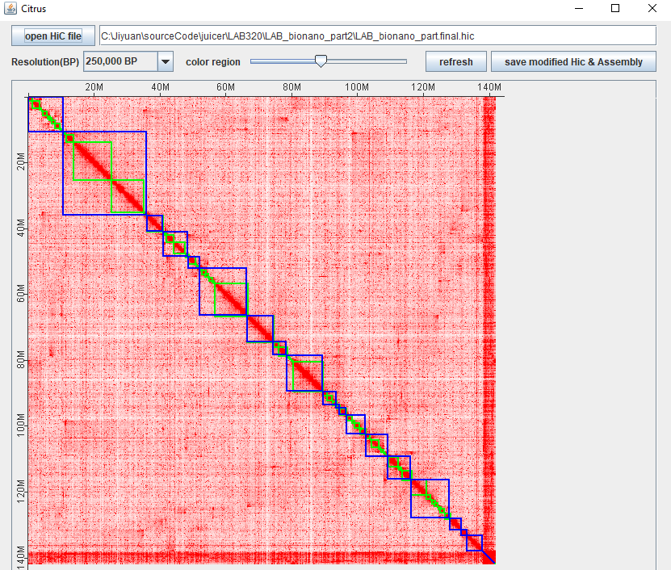
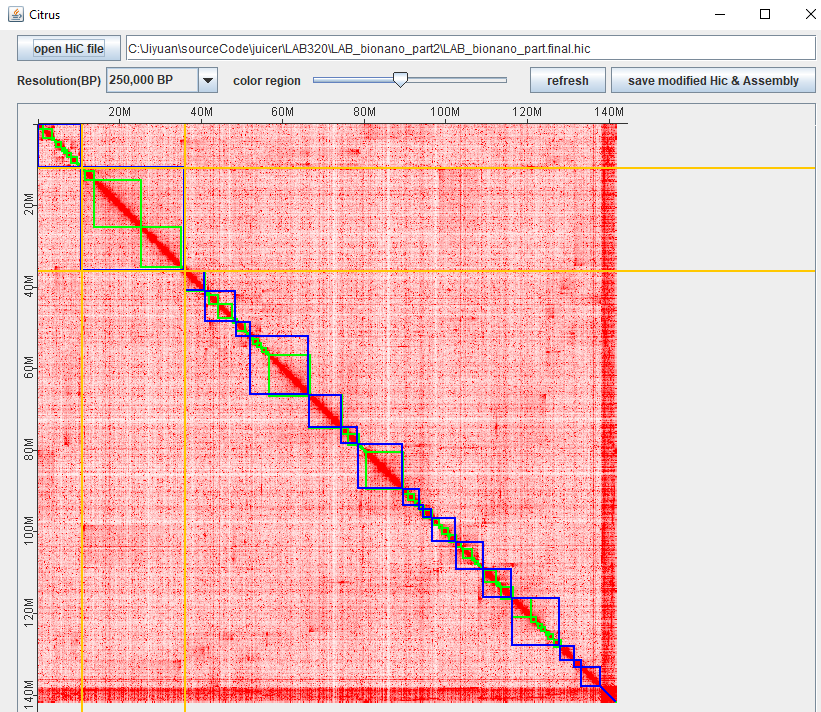
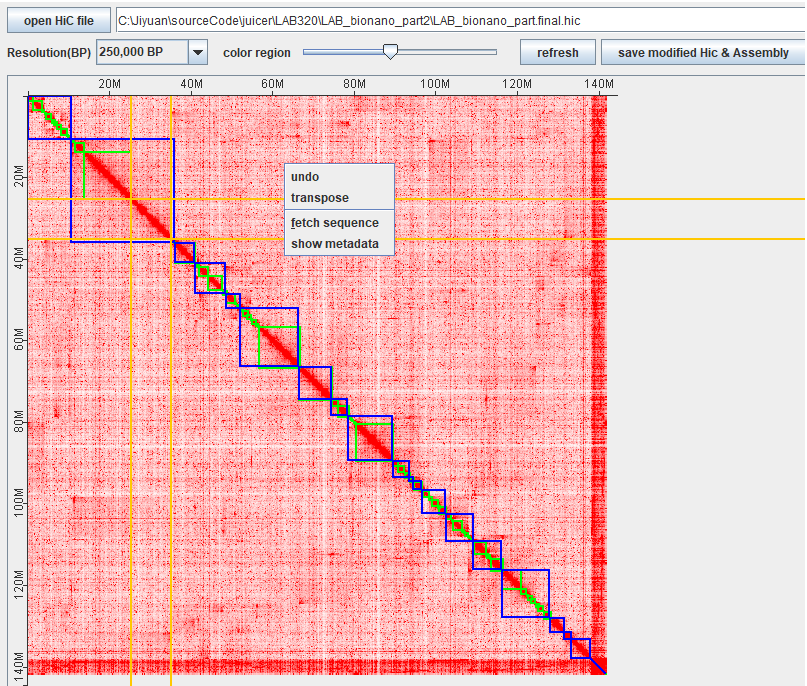
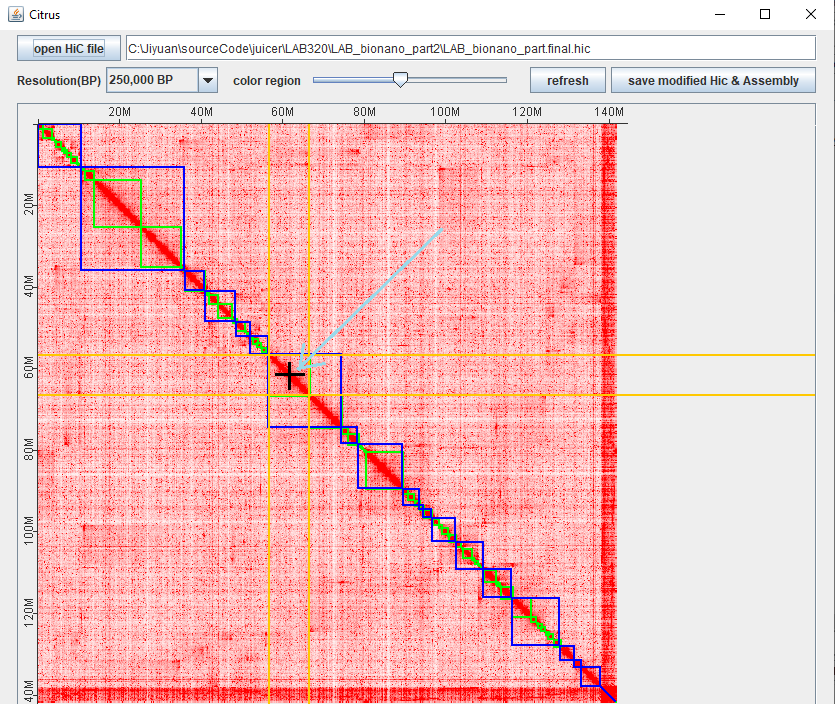

# Citrus: Editing HiC data for de novo genome assembly
[juicer](https://github.com/aidenlab/juicer) and [3D-DNA](https://github.com/aidenlab/3d-dna) 
are two tools that re-arrange HiC data (xxx.hic format) and 
split/re-order super-scaffold data(xxx.assembly) to imporve de novo assembly. [juicebox](https://github.com/aidenlab/Juicebox) was specifically
designed to tune
or adjuste genomic sequences based on on the HiC data. However, the current 
Juicebox version does not have a function to save updated Hic data and 
summraize chromosome sequences. Thus we created 
Citrus which can edit super-scaffolds according to chromatin conformation data captured 
in xxx.hic. Citrus updates HiC and assemble and chromosome level sequences.
## quick start
1. run Citrus
    1. **Linux or MacOs:**  > bash Citrus.sh
    2. **windows:** double click Citrus.bat
2. outlook of Citrus
    
    after starting Citrus, the figure above is generated, "**Resolution(BP)**" dropdown menu 
Zooms in/out Hic data. "**refresh**" button is clicked to make the changes. 
The slider bar of "**color range**" changes the depth of color.
3. how to select block/blocks of interest?
    1. shift + mouse-left-click: select one block (green block)
       
    2. control + mouse-left-click: select one chromosome block (blue block)
       
4. how to move block?
    1. locate cursor to insert. if cursor cover more than one edge of blocks, popup 
   window "multi blocks in the area" appears. higher resolution is needed. when 
   two ends of arrow appears, left click to make the selected block to insert.
       
5. how to transpose block, get sequence of selected block?
    1. after selecting blocks, right-clicking mouse shows menu to have various functions for
the selected block.
       
6. how to spilt one block into two?
    1. after selecting blocks, move mouse on the  diagonal in the blocks. 
the cursor changes to cross and left click the mouse, the block will be splitted into two.
       
